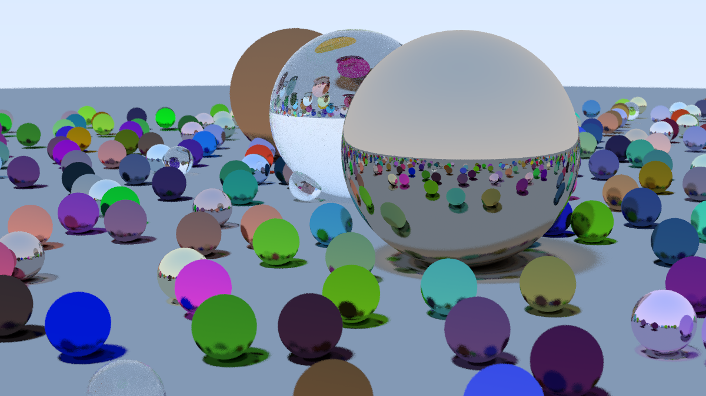

# About
A simple ray tracer based on ray tracing in one weekend. The image being rendered is done parallely using all 16 threads of a CPU (can be changed by changing the omp_set_num_threads parameter)

### TODO 
Render using CUDA cores of an nvidia GPU

# Build and run
## Linux
Only g++/gcc commands included to compile as clang required external lib to use omp headers. Use libomp and use with clang++ with no issues
```
chmod +x run.sh
./run.sh
```

## Windows
Not tested here but should work under MingGW. For MSVC I have no idea.

